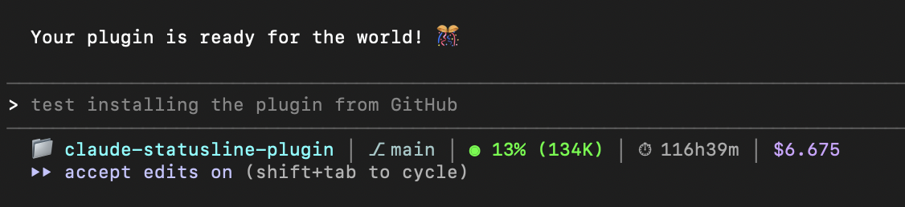

# Enhanced Status Line Plugin for Claude Code

[](https://github.com/deepan-g2/claude-statusline-plugin/stargazers)
[](https://github.com/deepan-g2/claude-statusline-plugin/network/members)
[](https://github.com/deepan-g2/claude-statusline-plugin/watchers)
[](https://hits.seeyoufarm.com)
[](https://opensource.org/licenses/MIT)
[](https://github.com/deepan-g2/claude-statusline-plugin/releases)

A beautiful, informative status line for Claude Code that displays real-time session metrics, git status, token usage, and more.

## 🎨 Features

- **📁 Directory Display** - Current working directory
- **⎇ Git Integration** - Branch name, uncommitted changes (*), unpushed commits (↑N)
- **◉ Smart Context Tracking** - Percentage + actual token count with color coding
  - Green (< 60%) - All good
  - Yellow (60-80%) - Watch it
  - Orange (> 80%) - Warning!
- **⏱ Session Duration** - Track how long you've been working
- **+/- Code Changes** - Lines added and removed in session
- **💰 Cost Monitoring** - Real-time cost tracking

## 📸 Preview



**Example output:**
```
📁 myproject │ ⎇ main*↑3 │ ◉ 45% (450K) │ ⏱ 1h30m │ +320/-145 │ $0.450
```

## 📦 Installation

### From GitHub (Recommended)

```bash
# Add the plugin marketplace
/plugin marketplace add deepan-g2/claude-statusline-plugin

# Install the plugin
/plugin install enhanced-statusline@deepan-statusline-plugins
```

### Local Development

```bash
# Clone the repository
git clone https://github.com/deepan-g2/claude-statusline-plugin.git
cd claude-statusline-plugin

# Test locally
claude --plugin-dir ./
```

## 🚀 Quick Start

After installation, activate the status line:

```bash
# Inside Claude Code
/enhanced-statusline:setup-statusline
```

Or manually add to your `~/.claude/settings.json`:

```json
{
  "statusLine": {
    "type": "command",
    "command": "~/.claude/plugins/enhanced-statusline/scripts/statusline.sh",
    "padding": 0
  }
}
```

Then restart your Claude Code session!

## 🎨 Customization

### Change Colors

Edit the script at `scripts/statusline.sh` (lines 86-96):

```bash
CYAN="\033[38;5;87m"      # Change to any 0-255 color
GREEN="\033[38;5;46m"
YELLOW="\033[38;5;228m"
ORANGE="\033[38;5;214m"
PURPLE="\033[38;5;141m"
```

### Popular Color Schemes

**Dracula Theme:**
```bash
CYAN="\033[38;5;117m"
GREEN="\033[38;5;84m"
ORANGE="\033[38;5;215m"
PURPLE="\033[38;5;141m"
```

**Ocean Blue:**
```bash
CYAN="\033[38;5;81m"
GREEN="\033[38;5;48m"
ORANGE="\033[38;5;116m"
PURPLE="\033[38;5;69m"
```

### View All Colors

```bash
for i in {0..255}; do
  echo -e "\033[38;5;${i}m${i}\033[0m"
done
```

## 📚 Available Commands

- `/enhanced-statusline:setup-statusline` - Configure the status line
- `/enhanced-statusline:color-scheme` - Change color themes

## 🔧 Requirements

- Claude Code CLI
- `jq` (for JSON parsing)
- `bc` (for calculations)
- Git (optional, for git status features)

Install dependencies:

```bash
# macOS
brew install jq bc

# Linux
apt-get install jq bc
```

## 📖 Documentation

### Status Line Components

| Component | Description | Example |
|-----------|-------------|---------|
| 📁 Directory | Current folder name | `📁 myproject` |
| ⎇ Git | Branch + status | `⎇ main*↑3` |
| ◉ Context | Token usage % + count | `◉ 45% (450K)` |
| ⏱ Duration | Session time | `⏱ 1h30m` |
| +/- Lines | Code changes | `+320/-145` |
| 💰 Cost | Session cost | `$0.450` |

### Git Status Indicators

- `*` - Uncommitted changes present
- `↑N` - N unpushed commits
- No indicator - Clean working tree

### Context Warning Levels

- **Green ◉** - Less than 60% context used
- **Yellow ◉** - 60-80% context used
- **Orange ⚠** - More than 80% context used (consider compacting)

## 🛠 Troubleshooting

### Colors not showing?
```bash
# Check terminal color support
echo $TERM  # Should be xterm-256color or similar
export TERM=xterm-256color
```

### jq not found?
```bash
# Install jq
brew install jq  # macOS
apt-get install jq  # Linux
```

### Status line not updating?
- Restart Claude Code session
- Check script permissions: `chmod +x scripts/statusline.sh`
- Test manually: `echo '{}' | ./scripts/statusline.sh`

## 🤝 Contributing

Contributions welcome! Please:

1. Fork the repository
2. Create a feature branch (`git checkout -b feature/amazing-feature`)
3. Commit your changes (`git commit -m 'Add amazing feature'`)
4. Push to the branch (`git push origin feature/amazing-feature`)
5. Open a Pull Request

## 📝 License

MIT License - feel free to use and modify!

## 🌟 Credits

Created by Deepan Kumar ([@deepan-g2](https://github.com/deepan-g2)). Inspired by Oh-My-Zsh themes and Starship prompt.

## 📮 Support

- Report issues: [GitHub Issues](https://github.com/deepan-g2/claude-statusline-plugin/issues)
- Discussions: [GitHub Discussions](https://github.com/deepan-g2/claude-statusline-plugin/discussions)
- Documentation: [Wiki](https://github.com/deepan-g2/claude-statusline-plugin/wiki)

---

Made with ❤️ for the Claude Code community
